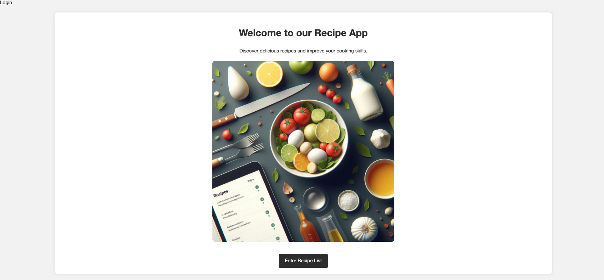

# Recipe App: Search Criteria Ideas

## 1. **Recipe Name**
   - Allow users to search recipes by name, so they can easily find specific dishes they are interested in. 

## 2. **Ingredients**
   - Users can search for recipes based on available ingredients. This feature will help users find recipes that match the ingredients they already have in their kitchen.

## 3. **Cuisine Type**
   - Include a filter for cuisine type, such as Italian, Mexican, Indian, or Chinese, to help users find recipes from specific cultures or regions.

## 4. **Cooking Time**
   - Let users filter recipes by preparation and cooking time, so they can choose meals that fit their schedule. Example: under 30 minutes, 1-hour meals, etc.

## 5. **Meal Type**
   - Users can search for recipes based on meal type, such as breakfast, lunch, dinner, snack, or dessert.

## 6. **Dietary Preferences**
   - Include search filters for various dietary preferences like vegan, vegetarian, gluten-free, dairy-free, or keto.

## 7. **Difficulty Level**
   - Let users filter recipes based on difficulty levels like beginner, intermediate, or advanced, depending on their cooking skills.

## 8. **Calories or Nutritional Value**
   - Allow users to search recipes based on the calorie count or specific nutritional requirements, such as high protein, low carb, or low fat.

## 9. **Seasonal Recipes**
   - Provide a search option to find recipes based on the season (e.g., winter, summer), with ingredients that are typically available during those times.

## 10. **Chef or Author**
   - Users can search for recipes created by specific chefs, authors, or popular food bloggers featured in your app.

## 11. **Popularity or Ratings**
   - Allow users to filter recipes based on popularity, reviews, or ratings, so they can easily find highly recommended dishes.

## 12. **Allergen-Free Recipes**
   - Include a search filter for allergen-free recipes (e.g., nut-free, soy-free, shellfish-free) for users with specific allergies.

## 13. **Occasion**
   - Let users search for recipes based on special occasions like holidays, birthdays, parties, or family gatherings.

## 14. **Cooking Method**
   - Provide filters for cooking methods such as baking, grilling, frying, steaming, or slow cooking.

## 15. **Serving Size**
   - Users can search based on the number of servings, helping them find recipes that cater to small or large groups.

## 16. **Data Analysis**
   - **Bar Chart**: Visualize the recipes by cooking time.
     - **X-axis**: Recipe Name
     - **Y-axis**: Cooking Time

   - **Pie Chart**: Show the cooking time comparison of different recipes.
     - **Labels**: Recipe Name
     - **Values**: Percentage of Cooking Time Distribution

   - **Line Chart**: Display Line Graph of Cooking Time by Recipe. 
     - **X-axis**: Cooking Time (in minutes)
     - **Y-axis**: Recipe Names

## 16. **Execution Flow**

### A. Homepage
- User lands on the homepage.

### B. Login
- User clicks on the login link and is redirected to the login page.

### C. Login Form
- User fills in the login form and submits it.
  - If login is successful, user is redirected to the recipe list page.
  - If login fails, an error message is displayed.

### D. Recipe List Page
- User sees the list of recipes and a search form.

### F. Search for Recipe
- User fills in the search form and submits it.
  - If search results are found, they are displayed along with the chart.
  - If no results are found, a "no data" message is displayed.

### G. Display Results and Chart
- Search results and the corresponding chart are displayed.

### H. No Data Message
- A message indicating no data is displayed if no search results are found.

### I. View Recipe Details
- User clicks on a recipe to view its details.

### J. Logout
- User clicks on the logout link and is redirected to the logout success page.

### K. Logout Success Page
- User is redirected to the logout success page.

   
   ### Flowchart Visualization
   
   

   

   

   

   

   

   