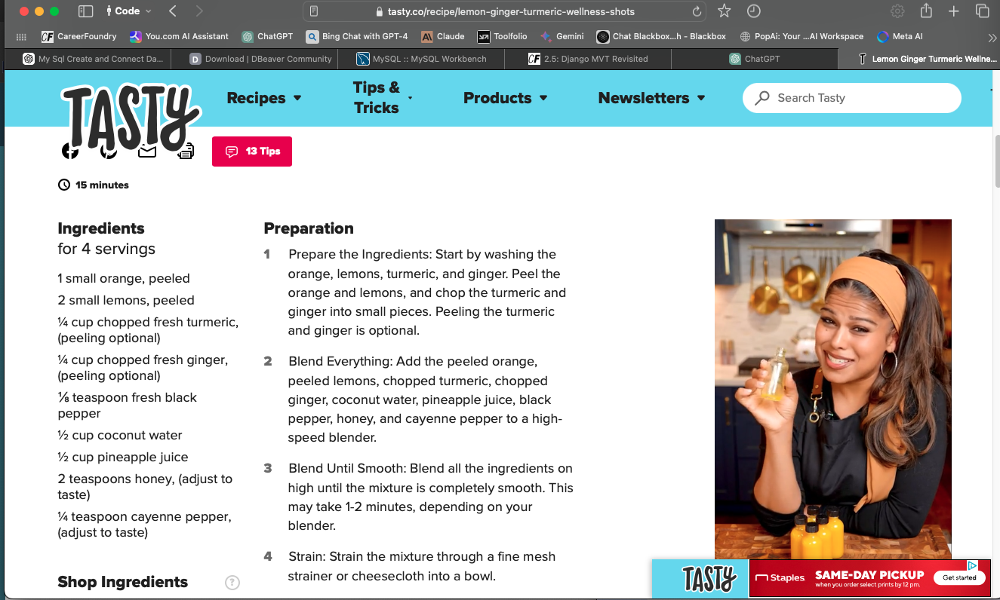
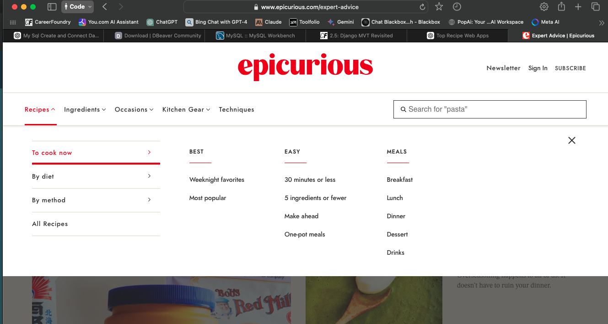
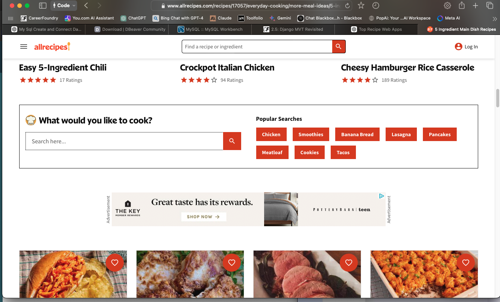

# Reflection Questions for Exercise 2.1: Getting Started with Django

#### 1. Suppose you’re a web developer in a company and need to decide if you’ll use vanilla (plain) Python for a project, or a framework like Django instead. What are the advantages and drawbacks of each?

**Vanilla Python:**
- **Advantages:**
  - **Flexibility:** Offers complete control over every aspect of the project without being bound by the constraints of a framework.
  - **Lightweight:** No overhead of additional libraries or frameworks, which can result in better performance for simple projects.
  - **Learning Opportunity:** Provides a deep understanding of how things work under the hood, such as request handling and database interaction.
  
- **Drawbacks:**
  - **Development Speed:** Building web applications from scratch with vanilla Python can be time-consuming, especially when implementing common features like authentication, routing, and database management.
  - **Reinventing the Wheel:** You may need to write a lot of boilerplate code for basic functionalities that are readily available in frameworks like Django.
  - **Security Concerns:** Managing security features (e.g., CSRF protection, SQL injection prevention) manually can be error-prone.

**Django:**
- **Advantages:**
  - **Rapid Development:** Django provides a lot of built-in features like an admin interface, authentication system, and ORM, which speeds up development significantly.
  - **Scalability:** Django’s structure and best practices promote scalable code, making it easier to maintain and expand the project as it grows.
  - **Security:** Django comes with built-in security features like CSRF protection, SQL injection prevention, and XSS protection.
  - **Community Support:** Django has a large community, extensive documentation, and a plethora of third-party packages that can be integrated into your project.

- **Drawbacks:**
  - **Learning Curve:** While Django is powerful, it can be complex for beginners, especially if they are unfamiliar with frameworks.
  - **Overhead:** For small projects, Django might be overkill, adding unnecessary complexity and performance overhead.
  - **Less Flexibility:** Django enforces a certain way of doing things, which can be restrictive if you need more control over certain aspects of your application.

#### 2. In your own words, what is the most significant advantage of Model View Template (MVT) architecture over Model View Controller (MVC) architecture?

The most significant advantage of the Model View Template (MVT) architecture over the Model View Controller (MVC) architecture is the **separation of concerns** with a simplified structure. In MVT, the "Template" component handles both the view and presentation logic, making it easier to maintain and organize code, especially when building complex web applications. This separation reduces redundancy and keeps the logic and presentation layers distinct, resulting in more maintainable and cleaner code. MVT also aligns closely with how web development works in practice, as the template directly interacts with the data and presentation, reducing the need for extra layers of abstraction like in MVC.

#### 3. Now that you’ve had an introduction to the Django framework, write down three goals you have for yourself and your learning process during this Achievement.

1. **Deepen Understanding of Django’s Core Features:**
   - I want to gain a solid understanding of Django’s core features, including the ORM, URL routing, and template engine. Mastering these aspects will help me build robust web applications quickly and efficiently.

2. **Build a Real-World Project:**
   - My goal is to create a functional web application using Django that incorporates user authentication, data management, and a polished front-end interface. This project will serve as a portfolio piece and help solidify my learning.

3. **Prepare for Professional Opportunities:**
   - After completing this Achievement, I want to feel confident enough to apply for positions or freelance work involving Django. I aim to be able to discuss Django’s benefits, best practices, and how to integrate it with other technologies in a professional setting.


# Exercise 2.2: Django Project Set Up

## Learning Goals
- Describe the basic structure of a Django project
- Summarize the difference between projects and apps
- Create a Django project and run it locally
- Create a superuser for a Django web application

## Reflection Questions

### 1. Converting a Website into Django Terms
Suppose you’re in an interview, and the interviewer gives you their company’s website as an example, asking you to convert the website and its different parts into Django terms. How would you proceed? 

**Answer:**
To convert a company's website into Django terms, I would begin by identifying the different sections and functionalities of the website. Each section that represents a distinct functionality or feature would be mapped to a Django app. For instance:
- **Home Page:** The main landing page could be an app that manages static content or dynamic content if needed.
- **User Accounts:** Any section related to user authentication, such as login, registration, and profile management, would be handled by a separate app.
- **Blog or News Section:** If the website has a blog or news section, it would be represented as an app that manages posts, categories, and comments.
- **Products or Services:** An app could be created to manage the products or services offered by the company, including features such as listing products, adding to cart, and checkout.
- **Admin Interface:** Django’s built-in admin would be used to manage all these apps and their associated models, making it easy for the company to update content.

Each app would be a modular component within the larger Django project, with the project serving as the overarching structure that ties everything together.

### 2. Deploying a Basic Django Application Locally
In your own words, describe the steps you would take to deploy a basic Django application locally on your system.

**Answer:**
To deploy a basic Django application locally, I would follow these steps:
1. **Install Django:** First, I would ensure that Django is installed in my local environment using `pip install django`.
2. **Start a New Project:** I would create a new Django project using the `django-admin startproject project_name` command.
3. **Create an App:** Within the project, I would create one or more apps using the `python manage.py startapp app_name` command, where each app corresponds to a specific feature or section of the application.
4. **Migrate Database:** I would run `python manage.py migrate` to apply migrations and set up the database.
5. **Create Superuser:** To manage the application through the admin interface, I would create a superuser using `python manage.py createsuperuser`.
6. **Run the Server:** Finally, I would start the development server with `python manage.py runserver` and access the application locally through my browser.

### 3. Using the Django Admin Site
Do some research about the Django admin site and write down how you’d use it during your web application development.

**Answer:**
The Django admin site is a powerful tool for managing the backend of a web application. It automatically generates an interface for managing the models and data in the database. During development, I would use the admin site to:
- **Manage Content:** Add, update, or delete content such as blog posts, products, or user profiles directly from the admin interface.
- **Test Models:** Verify that my models and relationships are set up correctly by interacting with the data through the admin.
- **User Management:** Create, update, and manage user accounts and permissions, ensuring that only authorized users have access to specific parts of the application.
- **Track Changes:** Monitor and track changes made to the data, especially when collaborating with other developers.
- **Customize Admin:** If needed, I could customize the admin interface to provide a better user experience for the site administrators.

# Exercise 2.3: Django Models

## Learning Goals

- Discuss Django models, the “M” part of Django’s MVT architecture
- Create apps and models representing different parts of your web application
- Write and run automated tests

## Reflection Questions

### 1. How Django Models Work and Their Benefits

Django models are a fundamental part of Django’s Model-View-Template (MVT) architecture. They represent the "Model" in MVT, which is responsible for handling the data and business logic of an application. 

**How Django Models Work:**

- **Definition**: A Django model is a Python class that subclasses `django.db.models.Model`. Each model class represents a database table, and each model instance represents a row in that table.
- **Fields and Methods**: Models define fields (such as `CharField`, `IntegerField`, etc.) that represent columns in the database table. Methods can be added to perform actions related to the data.
- **Database Abstraction**: Django models abstract away the complexities of database operations. They provide a high-level API to interact with the database, enabling CRUD (Create, Read, Update, Delete) operations without writing raw SQL queries.
- **Migration System**: Django models come with a migration system that helps manage changes to the database schema. Changes made to models are translated into database schema changes through migration files.

**Benefits of Django Models:**

- **Simplified Database Management**: Models provide a straightforward way to manage and interact with the database, making it easier to perform complex queries and operations.
- **Automatic Admin Interface**: Django’s admin interface is automatically generated from the models, providing a user-friendly interface for managing data.
- **Validation and Integrity**: Models include built-in validation to ensure that data adheres to the defined constraints (e.g., field types, maximum lengths), which helps maintain data integrity.
- **Code Reusability**: By defining models in a single place, you avoid code duplication and ensure that data handling is consistent across the application.

### 2. Importance of Writing Test Cases from the Beginning

Writing test cases from the beginning of a project is crucial for several reasons:

**1. Ensures Code Quality:**
   - **Example**: Suppose you’re developing a recipe application where users can add, edit, and delete recipes. Writing tests for these functionalities ensures that each feature works as expected and prevents bugs from being introduced during development.

**2. Facilitates Refactoring:**
   - **Example**: If you need to refactor the code to optimize the recipe search functionality.

# Exercise 2.4: Django Views and Templates
Learning Goals

Summarize the process of creating views, templates, and URLs
Explain how the “V” and “T” parts of MVT architecture work
Create a frontend page for your web application

## Reflection Questions

### 1. Do some research on Django views. In your own words, use an example to explain how Django views work.

Django views act as the bridge between the models (database) and templates (HTML). They contain the logic for processing requests and returning appropriate responses. When a user makes a request (e.g., visiting a URL), Django matches the URL to a corresponding view function, which then fetches necessary data, processes it, and returns a response—usually an HTML page rendered from a template.

Example:
Imagine a blog website. When a user visits the homepage, you want to display a list of blog posts. In Django, you create a view that queries the database for all blog posts and then passes that data to a template, which generates the HTML page. Here's a basic example of a Django view:

```python
from django.shortcuts import render
from .models import Post

def home(request):
    posts = Post.objects.all()
    return render(request, 'blog/home.html', {'posts': posts})
```
In this example, the home view queries the Post model for all posts and passes them to the home.html template. The template then handles displaying the posts to the user.

### 2. Imagine you’re working on a Django web development project, and you anticipate that you’ll have to reuse lots of code in various parts of the project. In this scenario, will you use Django function-based views or class-based views, and why?

In this scenario, I would prefer using class-based views (CBVs). CBVs allow for more reusable and organized code by leveraging inheritance and mixins. They offer a modular approach where common functionalities can be abstracted into base classes and reused across different views.

For example, if you have multiple views that handle displaying lists of objects, you can use Django’s ListView class, which provides built-in functionality for querying and rendering lists of objects. You can extend this class to customize behavior as needed. This reduces code duplication and makes the application easier to maintain.

On the other hand, function-based views (FBVs) are more straightforward and might be preferable for simple views or when you need fine-grained control. However, for projects with reusable components, CBVs offer a cleaner and more efficient approach.

### 3. Read Django’s documentation on the Django template language and make some notes on its basics.

- Template Variables:
Variables enclosed in double curly braces {{ }}. For example, {{ post.title }} will output the title attribute of a post object passed to the template.

- Template Tags:
Template tags perform logic in the template. They are enclosed in . For example, ... loops over all post objects.

- Filters:
Filters modify variables within templates. They are applied using the pipe | symbol. For example, {{ post.title|upper }} will convert the title to uppercase.

- Template Inheritance:
Django allows templates to extend other templates, making it easy to reuse common layout elements. The base template defines the structure, and child templates override specific blocks. For example:

```html
<!-- base.html -->
<html>
  <body>
    
  </body>
</html>

<!-- home.html -->


  <h1>Welcome to the Blog!</h1>


```
- Static Files:
Use  to load static files like CSS or JavaScript. For example, <link rel="stylesheet" href="">.

# Exercise 2.5: Django MVT Revisited

## Frontend Recipe App Inspirations

### 1.  Tasty (by BuzzFeed)



https://tasty.co

 - Tasty's vibrant and engaging design is what sets it apart. 
 
 - It combines high-quality images and videos with a clean layout that makes it easy to navigate. 
  
 - The app's step-by-step instructions with video clips are especially useful for visual learners. 
  
 - The filtering options, such as dietary preferences and meal type, enhance user experience, making it easy to find the perfect recipe.

### 2. Epicurious



https://www.epicurious.com

- Epicurious has a polished, professional design that appeals to food enthusiasts. 
  
- The app provides detailed recipe instructions, accompanied by stunning food photography that makes the dishes look enticing. 
  
- Its search functionality is powerful, allowing users to filter recipes by skill level, ingredients, and more. 
  
- The "cook mode" feature simplifies cooking by displaying recipes in a clear, step-by-step manner with larger text.

### 3. AllRecipes



https://www.allrecipes.com

 - AllRecipes focuses on community-driven content, allowing users to share and rate recipes.
   
 - Its design is clean and user-friendly, with a strong emphasis on user reviews and suggestions. 
  
 - The app's "Dinner Spinner" feature is a fun way to discover new recipes, and the customization options let users tailor recipes to their tastes. 
  
 - The app's integration of community feedback and video tutorials makes it a go-to for everyday cooking.

## Learning Goals

- Add images to the model and display them on the frontend of your application.
- Create complex views with access to the model.
- Display records with views and templates.

## Reflection Questions

### 1. In your own words, explain Django static files and how Django handles them.

Django static files refer to files such as images, CSS, and JavaScript that are not dynamically generated by the server but are necessary for the frontend of your application. Django handles static files by serving them during development using the `django.contrib.staticfiles` app, which provides the infrastructure for collecting and serving these files. In production, static files are usually served by a web server like Nginx or Apache, and Django allows you to collect all static files into a single directory using the `collectstatic` command, making them easier to serve.

### 2. Look up the following two Django packages on Django’s official documentation and/or other trusted sources. Write a brief description of each.

| Package     | Description                                                                                                                                                          |
|-------------|----------------------------------------------------------------------------------------------------------------------------------------------------------------------|
| **ListView**   | `ListView` is a Django class-based view that displays a list of objects from a specific model. It simplifies the process of creating list views by handling the logic for querying the database, rendering a template, and passing the context to the template. Developers can customize the behavior of `ListView` by overriding its methods. |
| **DetailView** | `DetailView` is a Django class-based view that displays a single object from a specific model. It handles retrieving an object based on a primary key or slug and rendering a template to display the object's details. `DetailView` is useful for creating views that show detailed information about a specific instance of a model.                        |

### 3. You’re now more than halfway through Achievement 2! Take a moment to reflect on your learning in the course so far. How is it going? What’s something you’re proud of so far? Is there something you’re struggling with? What do you need more practice with? You can use these notes to guide your next mentor call.

*Reflect on your learning journey so far:*

- **How is it going?** 
  
  I feel like my understanding of Django's MVT architecture is improving as I work through the exercises. Adding functionality to my projects has become more intuitive.

- **What’s something you’re proud of so far?** 
  
  I'm proud of successfully implementing complex views and getting comfortable with Django's ORM to interact with the database efficiently.

- **Is there something you’re struggling with?** 
  
  I still find myself struggling with advanced template customization and handling forms with more complex validation logic.

- **What do you need more practice with?** 
  
  I need more practice with deploying Django applications and optimizing the use of static files in production environments.

# Exercise 2.6: User Authentication in Django

## Learning Goals

- Create authentication for your web application.
- Use GET and POST methods.
- Password protect your web application’s views.

## Reflection Questions

### 1. In your own words, write down the importance of incorporating authentication into an application. You can take an example application to explain your answer.

Authentication is crucial for securing access to an application by ensuring that only authorized users can access certain features or data. For example, in an online banking application, authentication ensures that only the account holder can view their account details, make transactions, or update personal information. Without proper authentication, anyone could gain access to sensitive information, leading to potential security breaches and data theft.

### 2. In your own words, explain the steps you should take to create a login for your Django web application.

To create a login for your Django web application, you can follow these steps:

1. **Create a User Model:** Ensure that your application has a user model, either the default Django user model or a custom one.
2. **Set Up Authentication Views:** Use Django’s built-in `LoginView` or create a custom view for handling user login. This view will handle GET requests to display the login form and POST requests to process login credentials.
3. **Create a Login Template:** Design an HTML template for the login page that includes fields for the username and password.
4. **Configure URLs:** Add a URL pattern in your `urls.py` file to point to your login view.
5. **Restrict Access to Views:** Use Django’s `@login_required` decorator to restrict access to certain views, ensuring that only authenticated users can access them.
6. **Handle User Sessions:** Once authenticated, Django will create a session for the user, allowing them to stay logged in as they navigate the site.

### 3. Look up the following three Django functions on Django’s official documentation and/or other trusted sources and write a brief description of each.

| Function         | Description                                                                                                                                                      |
|------------------|------------------------------------------------------------------------------------------------------------------------------------------------------------------|
| **authenticate()** | `authenticate()` is a Django function used to verify a user's credentials. It takes the username and password as arguments and returns a user object if the credentials are valid. If the credentials are invalid, it returns `None`. This function is typically used in login views to validate user input. |
| **redirect()**    | `redirect()` is a Django function used to redirect the user to a different URL. It takes a URL or a view name as an argument and returns an HTTP response that directs the user's browser to the specified location. This function is commonly used after a successful form submission or login.               |
| **include()**     | `include()` is a Django function that allows you to reference other URL configurations. It's used to modularize your `urls.py` file by including URL patterns from other apps or parts of your project. This makes it easier to manage and organize your project's URLs.                                      |

### Exercise 2.7: Data Analysis and Visualization in Django

#### Learning Goals

- Work on elements of two-way communication like creating forms and buttons
- Implement search and visualization (reports/charts) features
- Use QuerySet API, DataFrames (with pandas), and plotting libraries (with matplotlib)

#### Reflection Questions

1. **Consider your favorite website/application (you can also take CareerFoundry). Think about the various data that your favorite website/application collects. Write down how analyzing the collected data could help the website/application.**

   Analyzing the collected data can help the website/application in several ways:
   - **User Behavior Analysis**: Understanding how users interact with the site can help in optimizing the user experience.
   - **Personalization**: Data can be used to personalize content and recommendations for users.
   - **Performance Monitoring**: Analyzing data can help in identifying performance bottlenecks and improving site speed.
   - **Marketing Strategies**: Insights from data can inform marketing strategies and campaigns.
   - **Product Development**: Data analysis can reveal user needs and preferences, guiding product development.

2. **Read the Django official documentation on QuerySet API. Note down the different ways in which you can evaluate a QuerySet.**

   Different ways to evaluate a QuerySet include:
   - **Iteration**: Iterating over the QuerySet.
   - **Slicing**: Using slicing to retrieve a subset of the QuerySet.
   - **Caching**: Using methods like `list()`, `len()`, `bool()`, and `repr()`.
   - **Aggregations**: Using aggregation functions like `count()`, `sum()`, `avg()`, `min()`, and `max()`.
   - **Conversion**: Converting the QuerySet to a list or other data structures.

3. **In the Exercise, you converted your QuerySet to DataFrame. Now do some research on the advantages and disadvantages of QuerySet and DataFrame, and explain the ways in which DataFrame is better for data processing.**

   **Advantages of QuerySet:**
   - **Lazy Evaluation**: QuerySets are lazily evaluated, meaning they are only executed when needed.
   - **Database Optimization**: QuerySets are optimized for database operations and can leverage database indexes and optimizations.
   - **Django Integration**: QuerySets are tightly integrated with Django's ORM, making them easy to use within Django projects.

   **Disadvantages of QuerySet:**
   - **Limited Data Manipulation**: QuerySets are limited in terms of data manipulation and transformation capabilities.
   - **Less Suitable for Complex Analysis**: QuerySets are not as suitable for complex data analysis and visualization tasks.

   **Advantages of DataFrame:**
   - **Rich Data Manipulation**: DataFrames provide a rich set of data manipulation and transformation functions.
   - **Integration with Libraries**: DataFrames can be easily integrated with other data analysis and visualization libraries like `matplotlib` and `seaborn`.
   - **In-Memory Processing**: DataFrames allow for in-memory data processing, which can be faster for certain tasks.

   **Disadvantages of DataFrame:**
   - **Memory Usage**: DataFrames can consume a lot of memory, especially with large datasets.
   - **Not Optimized for Databases**: DataFrames are not optimized for database operations and may require additional steps to load data from a database.

   **Ways in which DataFrame is better for data processing:**
   - **Complex Transformations**: DataFrames support complex data transformations and aggregations.
   - **Advanced Analysis**: DataFrames are better suited for advanced data analysis tasks.
   - **Visualization**: DataFrames can be easily used with plotting libraries to create visualizations.

### Exercise 2.8: Deploying a Django Project

#### Learning Goals

- Enhance user experience and look and feel of your web application using CSS and JS
- Deploy your Django web application on a web server
- Curate project deliverables for your portfolio

#### Reflection Questions

1. **Explain how you can use CSS and JavaScript in your Django web application.**

   - **CSS**: You can use CSS to style your Django web application by including CSS files in your templates. Place your CSS files in the `static` directory and link them in your HTML templates using the `` template tag.
   - **JavaScript**: JavaScript can be used to add interactivity to your Django web application. Similar to CSS, place your JavaScript files in the `static` directory and link them in your HTML templates. You can also use JavaScript frameworks and libraries like jQuery or React.

2. **In your own words, explain the steps you’d need to take to deploy your Django web application.**

   - **Prepare the Project**: Ensure your project is ready for deployment by setting `DEBUG = False` in `settings.py` and configuring allowed hosts.
   - **Set Up the Server**: Choose a web server (e.g., Apache, Nginx) and set it up on your hosting environment.
   - **Install Dependencies**: Install necessary dependencies on the server, including Python, Django, and any other required packages.
   - **Configure the Database**: Set up and configure the database on the server. Update the database settings in `settings.py`.
   - **Collect Static Files**: Run `python manage.py collectstatic` to collect all static files in a single directory.
   - **Configure WSGI**: Set up WSGI (e.g., Gunicorn) to serve your Django application.
   - **Set Up Domain and SSL**: Configure your domain and set up SSL for secure connections.
   - **Deploy**: Transfer your project files to the server and start the web server.

3. **(Optional) Connect with a few Django web developers through LinkedIn or any other network. Ask them for their tips on creating a portfolio to showcase Python programming and Django skills. Think about which tips could help you improve your portfolio.**

   After connecting with several Django web developers, here are some valuable tips I received for creating a portfolio:
   - **Showcase Real Projects**: Include real-world projects that demonstrate your skills and problem-solving abilities.
   - **Include Code Samples**: Provide links to your GitHub repositories with well-documented code.
   - **Highlight Key Skills**: Clearly list the technologies and frameworks you are proficient in.
   - **Write Case Studies**: Explain the challenges you faced in your projects and how you overcame them.
   - **Keep It Updated**: Regularly update your portfolio with new projects and skills.
   - **Use a Professional Design**: Ensure your portfolio is visually appealing and easy to navigate.

   These tips can help me improve my portfolio by making it more comprehensive, professional, and reflective of my skills and experiences.

4. **You’ve now finished Achievement 2 and, with it, the whole course! Take a moment to reflect on your learning:**
   - **What went well during this Achievement?**
     - I successfully implemented various features in my Django project, including forms, search functionality, and data visualization.
     - I was able to deploy my Django application on a web server without major issues.
   - **What’s something you’re proud of?**
     - I am proud of the user interface enhancements I made using CSS and JavaScript, which significantly improved the user experience.
   - **What was the most challenging aspect of this Achievement?**
     - The most challenging aspect was configuring the server and ensuring all dependencies were correctly installed for deployment.
   - **Did this Achievement meet your expectations? Did it give you the confidence to start working with your new Django skills?**
     - Yes, this Achievement met my expectations and gave me the confidence to start working on more complex Django projects. I feel well-prepared to apply my new skills in real-world scenarios.


  